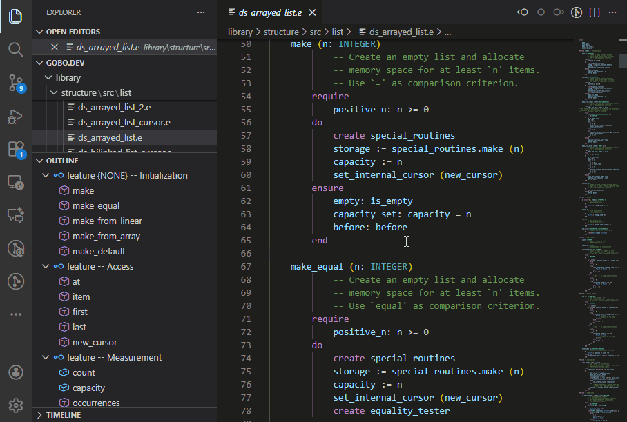
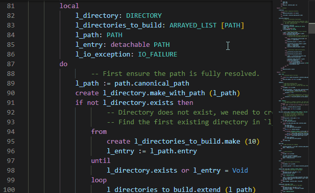
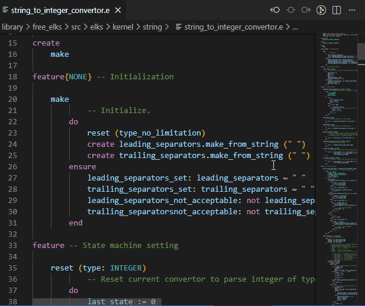

# Gobo Eiffel for Visual Studio Code

Bring the power of the
[*Gobo Eiffel*](https://www.gobosoft.com) toolchain directly into
Visual Studio Code, providing full language support for the
[Eiffel programming language](
https://en.wikipedia.org/wiki/Eiffel_%28programming_language%29
).
This extension lets you **edit, navigate, compile and run Eiffel
programs** seamlessly — ideal for both **beginners discovering
Eiffel** and **experienced developers** who want an efficient
workflow.

## ✨ Features

* **Syntax highlighting & language support**

  Eiffel keywords, comments and strings are highlighted using an
  up-to-date Eiffel grammar.

  

* **Code completion**

  Intelligent auto-completion for Eiffel code as you type, including
  class names, feature names, and context-aware suggestions based on
  the current scope and static type information.

  

* **Feature navigation**

  Quickly jump to a feature or feature clause within the current
  class from the *Outline* panel.

  

* **Feature signatures**

  Hover to view variable types and feature signatures directly in
  tooltips.

  

* **Go to definition**

  Navigate instantly to the definition of variables and features
  using the contextual menu.

  

* **Compile & run from VS Code**

  * Command to
    [compile the current Eiffel file](
    doc/compile_and_run_in_terminal.md
    )
    from the *Command Palette* or contextual menus.
  * Automatically run after compilation in the *Terminal* panel.
  * Set arguments and environment variables using *Launch
    Configurations*.
  * Generate and use ECF files for more advanced compilation
    settings.

  

* **Inline error reporting**

  Compilation errors appear as you type, with red squiggles in the
  *Editor* and entries in the *Problems* panel.
  Click an error to jump directly to its location.

  

* **Integrated Eiffel Terminal**

  Open a preconfigured terminal with *Gobo Eiffel*'s environment
  set up automatically, ready for command-line use.

  

* **Debug configurations**

  Easily create
  [launch configurations](
  doc/compile_and_run_in_debug_console.md
  )
  for your Eiffel programs.
  Pass custom arguments and environment variables, and choose
  between compile & run, compile-only or run-only modes from the
  *Run And Debug* panel or by pressing `F5`.

  

* **Automatic installation of Gobo Eiffel binaries**

  If needed, the extension can
  [download and install](
  doc/select_gobo_eiffel_installation.md
  )
  *Gobo Eiffel* and automatically check for updates.

## 🧭 Code Navigation

The Gobo Eiffel extension provides rich navigation features that are
fully integrated with standard VS Code commands and tailored to the
Eiffel language.

You can quickly explore classes, features, inheritance hierarchies,
and type relationships across your entire workspace, including
library code.

* **[Go to Definition](doc/go_to_definition.md)**  
  Navigate to the declaration of features, variables, classes,
  arguments, locals, and other Eiffel symbols.

* **[Go to Type Definition](doc/go_to_type_definition.md)**  
  Jump directly to the class that defines the type of a symbol.

* **[Go to Implementations](doc/go_to_implementations.md)**  
  Explore precursors and redeclarations of features across ancestor
  and descendant classes.

* **[Class and Feature Search](doc/class_and_feature_search.md)**  
  Quickly search for classes and features using the VS Code search
  bar and symbol navigation commands.

## ⚙️ User Settings

You can customize the extension in VS Code’s **Settings**
(File → Preferences → Settings → Extensions → Gobo Eiffel)
or via `settings.json`.

| Setting | Description | Default |
| ------- | ----------- | ------- |
| **`gobo-eiffel.automaticUpdateCheck`** | Automatically checks for new Gobo Eiffel releases. | `true` |
| **`gobo-eiffel.useNightlyBuild`** | Use Gobo Eiffel nightly build instead of the latest release. | `false` |
| **`gobo-eiffel.workspaceEcfFile`** | ECF file to analyze Eiffel classes in current workspace. | `null` |
| **`gobo-eiffel.workspaceEcfTarget`** | Target in ECF file to analyze Eiffel classes in current workspace. | `null` |

The last two settings are *workspace-specific settings* used to
specify the [workspace ECF file](doc/workspace_ecf_file.md),
which allows the Eiffel analyzer to discover and analyze the
classes used in the current project.

> You can also create multiple launch configurations in
> `.vscode/launch.json` with different arguments or environment
> variables for each program.

## 📦 Commands

All commands are available from the **Command Palette** or
contextual menus:

* [Compile & Run With Workspace ECF File](doc/compile_and_run_in_terminal.md#compile--run-with-workspace-ecf-file)
* [Compile With Workspace ECF File](doc/compile_and_run_in_terminal.md#compile-with-workspace-ecf-file)
* [Run With Workspace ECF File](doc/compile_and_run_in_terminal.md#run-with-workspace-ecf-file)
* [Lint With Workspace ECF File](doc/compile_and_run_in_terminal.md#run-with-workspace-ecf-file)
* [Compile & Run With Current ECF File](doc/compile_and_run_in_terminal.md#compile--run-with-current-ecf-file)
* [Compile With Current ECF File](doc/compile_and_run_in_terminal.md#compile-with-current-ecf-file)
* [Run With Current ECF File](doc/compile_and_run_in_terminal.md#run-with-current-ecf-file)
* [Lint With Current ECF File](doc/compile_and_run_in_terminal.md#run-with-current-ecf-file)
* [Compile & Run Eiffel File](doc/compile_and_run_in_terminal.md#compile--run-eiffel-file)
* [Compile Eiffel File](doc/compile_and_run_in_terminal.md#compile-eiffel-file)
* [Run Eiffel File](doc/compile_and_run_in_terminal.md#run-eiffel-file)
* [Lint Eiffel File](doc/compile_and_run_in_terminal.md#lint-eiffel-file)
* [Create ECF File](doc/create_ecf_file.md)
* [Select Workspace ECF File](doc/workspace_ecf_file.md#select-workspace-ecf-file)
* [Select Current File as Workspace ECF File](
  doc/workspace_ecf_file.md#select-current-file-as-workspace-ecf-file
  )
* [Show Workspace ECF File](
  doc/workspace_ecf_file.md#show-workspace-ecf-file
  )
* [New Gobo Eiffel Terminal](doc/new_gobo_eiffel_terminal.md)

## 💡 Tips for Beginners

* Start by opening a
  [single `.e` file](doc/hello_world.md)
  and run **Compile & Run Eiffel File** — no project setup needed.
* Errors appear directly in the editor with explanations in the
  *Problems* panel.

## 💪 Tips for Advanced Users

* Use multiple launch configurations to run different test
  scenarios.
* The integrated terminal automatically defines `$GOBO` and other
  environment variables.

## 📚 More Information

* [Gobo Eiffel Documentation](https://www.gobosoft.com)
* [Gobo Eiffel Code Repository](https://github.com/gobo-eiffel/gobo)
* [Eiffel Language Reference](https://www.eiffel.org)

---

Enjoy productive Eiffel development right inside VS Code!
