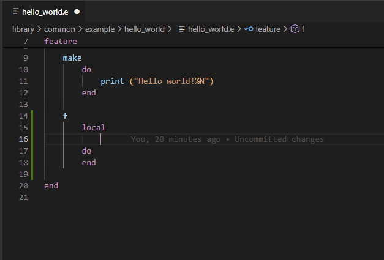
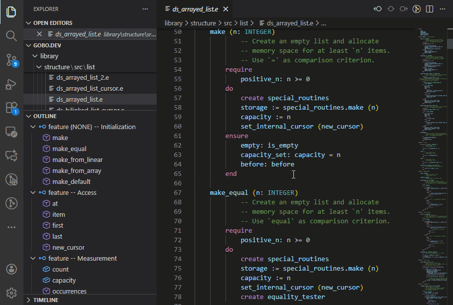
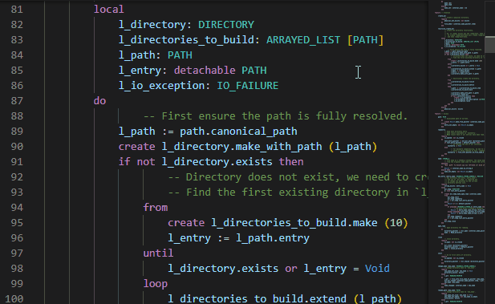
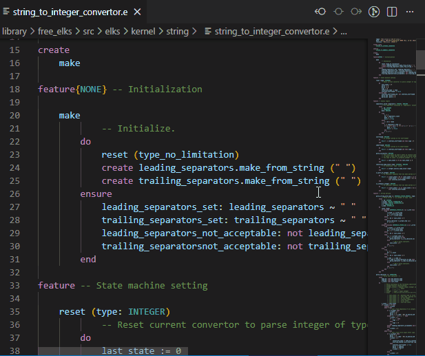
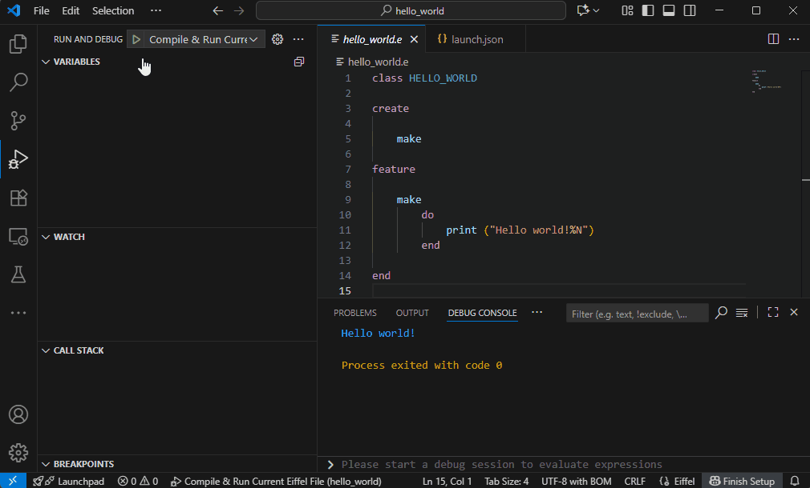

# Gobo Eiffel for Visual Studio Code

Bring the power of the
[*Gobo Eiffel*](https://www.gobosoft.com) toolchain directly into
Visual Studio Code, providing full language support for the
[Eiffel programming language](https://en.wikipedia.org/wiki/Eiffel_%28programming_language%29).
This extension lets you **edit, navigate, compile and run Eiffel
programs** seamlessly — ideal for both **beginners discovering
Eiffel** and **experienced developers** who want an efficient workflow.

## 🚀 Quick Start

Start coding in Eiffel **instantly** — no setup, no configuration, just run
your first program in seconds!  
Gobo Eiffel supports both **Beginner mode** for a single file and
**Advanced mode** for full workspace projects with ECF files.

### 1️⃣ Beginner: Hello World

If you are new to Eiffel, follow our
[Eiffel For Beginners](https://gobo-eiffel.github.io/gobo-vscode/doc/hello_world.html) guide.  
It shows how to create a simple `hello_world.e` file, compile it, and run it in VS Code.

> **Note:** No ECF file is needed for this simple workflow.

### 2️⃣ Advanced: Workspace with ECF File

For full projects with multiple classes, libraries, or targets:

1. Open your Eiffel project folder in VS Code.

2. Specify your **workspace ECF file** and target:
   * Right-click the ECF file → **Eiffel Configuration** → **Select Current File As Workspace ECF File**
   * Or right-click another file → **Eiffel Configuration** → **Select Workspace ECF File**

3. You now have full access to:
   * **Code navigation** (definitions, implementations, types)
   * **Feature callers/callees exploration**
   * **Client/supplier relationships**
   * **Inheritance hierarchy exploration**
   * **Code completion**
   * **Inline error reporting as you type**
   * **Compilation and execution**

## 🧩 At a Glance

| Capability | Description |
| ---------- | ----------- |
| Syntax highlighting | Full Eiffel syntax grammar with modern highlighting |
| Code completion | Context-aware completion for classes and features |
| Navigation | Jump to definitions, implementations and types |
| Hierarchy exploration | Call hierarchy, client/supplier relationships and inheritance trees |
| Compilation | Compile and run Eiffel programs directly from VS Code |
| Error reporting | Inline errors and integration with the Problems panel |
| Execution | Launch configurations |
| Integrated terminal | Preconfigured Gobo Eiffel command-line environment |

## ✨ Features

* **Syntax highlighting & language support**

  Eiffel keywords, comments and strings are highlighted using an
  up-to-date Eiffel grammar.

  

* **Code completion**

  Intelligent auto-completion for Eiffel code as you type, including
  class names, feature names, and context-aware suggestions based on
  the current scope and static type information.

  

* **Feature navigation**

  Quickly jump to a feature or feature clause within the current
  class from the *Outline* panel.

  

* **Feature signatures**

  Hover to view variable types and feature signatures directly in
  tooltips.

  

* **Go to definition**

  Navigate instantly to the definition of variables and features
  using the contextual menu.

  

* **Compile & run from VS Code**

  * Command to
    [compile the current Eiffel file](https://gobo-eiffel.github.io/gobo-vscode/doc/compile_and_run_in_terminal.html)
    from the *Command Palette* or contextual menus.
  * Automatically run after compilation in the *Terminal* panel.
  * Set arguments and environment variables using *Launch
    Configurations*.
  * Generate and use ECF files for more advanced compilation
    settings.

  

* **Inline error reporting**

  Compilation errors appear as you type, with red squiggles in the
  *Editor* and entries in the *Problems* panel.
  Click an error to jump directly to its location.

  

* **Integrated Eiffel Terminal**

  Open a preconfigured terminal with *Gobo Eiffel*'s environment
  set up automatically, ready for command-line use.

  

* **Debug configurations**

  Easily create
  [launch configurations](https://gobo-eiffel.github.io/gobo-vscode/doc/compile_and_run_in_debug_console.html)
  for your Eiffel programs.
  Pass custom arguments and environment variables, and choose
  between compile & run, compile-only or run-only modes from the
  *Run And Debug* panel or by pressing `F5`.

  

* **Automatic installation of Gobo Eiffel binaries**

  If needed, the extension can
  [download and install](https://gobo-eiffel.github.io/gobo-vscode/doc/select_gobo_eiffel_installation.html)
  *Gobo Eiffel* and automatically check for updates.

## 🧭 Code Navigation

The Gobo Eiffel extension provides rich navigation features that are
fully integrated with standard VS Code commands and tailored to the
Eiffel language.

You can quickly explore classes, features, inheritance hierarchies,
and type relationships across your entire workspace, including
library code.

### Symbol Navigation

* [Go to Definition](https://gobo-eiffel.github.io/gobo-vscode/doc/go_to_definition.html):
  Navigate to the declaration of features, variables, classes,
  arguments, locals, and other Eiffel symbols.
* [Go to Type Definition](https://gobo-eiffel.github.io/gobo-vscode/doc/go_to_type_definition.html):
  Jump directly to the class that defines the type of a symbol.
* [Go to Implementations](https://gobo-eiffel.github.io/gobo-vscode/doc/go_to_implementations.html):
  Explore precursors and redeclarations of features across ancestor
  and descendant classes.
* [Class and Feature Search](https://gobo-eiffel.github.io/gobo-vscode/doc/class_and_feature_search.html):
  Quickly search for classes and features using the VS Code search
  bar and symbol navigation commands.

### Hierarchy Exploration

Understand relationships between features and classes through
call hierarchies, dependency relationships, and inheritance trees.

* [Feature Callers/Callees](https://gobo-eiffel.github.io/gobo-vscode/doc/feature_callers_callees.html):
  Explore features that call or are called by a given feature.
* [Client/Supplier Classes](https://gobo-eiffel.github.io/gobo-vscode/doc/client_supplier_classes.html):
  Explore the client and supplier relationships of a given class.
* [Ancestor/Descendant Classes](https://gobo-eiffel.github.io/gobo-vscode/doc/ancestor_descendant_classes.html):
  Navigate the inheritance hierarchy of a class.

## ⚙️ User Settings

You can customize the extension in VS Code’s **Settings**
(File → Preferences → Settings → Extensions → Gobo Eiffel)
or via `settings.json`.

| Setting | Description | Default |
| ------- | ----------- | ------- |
| **`gobo-eiffel.automaticUpdateCheck`** | Automatically checks for new Gobo Eiffel releases. | `true` |
| **`gobo-eiffel.useNightlyBuild`** | Use Gobo Eiffel nightly build instead of the latest release. | `false` |
| **`gobo-eiffel.workspaceEcfFile`** | ECF file to analyze Eiffel classes in current workspace. | `null` |
| **`gobo-eiffel.workspaceEcfTarget`** | Target in ECF file to analyze Eiffel classes in current workspace. | `null` |

The last two settings are *workspace-specific settings* used to
specify the [workspace ECF file](https://gobo-eiffel.github.io/gobo-vscode/doc/workspace_ecf_file.html),
which allows the Eiffel analyzer to discover and analyze the
classes used in the current project.

> You can also create multiple launch configurations in
> `.vscode/launch.json` with different arguments or environment
> variables for each program.

## 📦 Commands

All commands are available from the **Command Palette** or
contextual menus:

* [Compile & Run With Workspace ECF File](https://gobo-eiffel.github.io/gobo-vscode/doc/compile_and_run_in_terminal.html#compile--run-with-workspace-ecf-file)
* [Compile With Workspace ECF File](https://gobo-eiffel.github.io/gobo-vscode/doc/compile_and_run_in_terminal.html#compile-with-workspace-ecf-file)
* [Run With Workspace ECF File](https://gobo-eiffel.github.io/gobo-vscode/doc/compile_and_run_in_terminal.html#run-with-workspace-ecf-file)
* [Lint With Workspace ECF File](https://gobo-eiffel.github.io/gobo-vscode/doc/compile_and_run_in_terminal.html#lint-with-workspace-ecf-file)
* [Compile & Run With Current ECF File](https://gobo-eiffel.github.io/gobo-vscode/doc/compile_and_run_in_terminal.html#compile--run-with-current-ecf-file)
* [Compile With Current ECF File](https://gobo-eiffel.github.io/gobo-vscode/doc/compile_and_run_in_terminal.html#compile-with-current-ecf-file)
* [Run With Current ECF File](https://gobo-eiffel.github.io/gobo-vscode/doc/compile_and_run_in_terminal.html#run-with-current-ecf-file)
* [Lint With Current ECF File](https://gobo-eiffel.github.io/gobo-vscode/doc/compile_and_run_in_terminal.html#lint-with-current-ecf-file)
* [Compile & Run Eiffel File](https://gobo-eiffel.github.io/gobo-vscode/doc/compile_and_run_in_terminal.html#compile--run-eiffel-file)
* [Compile Eiffel File](https://gobo-eiffel.github.io/gobo-vscode/doc/compile_and_run_in_terminal.html#compile-eiffel-file)
* [Run Eiffel File](https://gobo-eiffel.github.io/gobo-vscode/doc/compile_and_run_in_terminal.html#run-eiffel-file)
* [Lint Eiffel File](https://gobo-eiffel.github.io/gobo-vscode/doc/compile_and_run_in_terminal.html#lint-eiffel-file)
* [Create ECF File](https://gobo-eiffel.github.io/gobo-vscode/doc/create_ecf_file.html)
* [Select Workspace ECF File](https://gobo-eiffel.github.io/gobo-vscode/doc/workspace_ecf_file.html#select-workspace-ecf-file)
* [Select Current File as Workspace ECF File](https://gobo-eiffel.github.io/gobo-vscode/doc/workspace_ecf_file.html#select-current-file-as-workspace-ecf-file)
* [Show Workspace ECF File](https://gobo-eiffel.github.io/gobo-vscode/doc/workspace_ecf_file.html#show-workspace-ecf-file)
* [Set Environment Variables](https://gobo-eiffel.github.io/gobo-vscode/doc/workspace_ecf_file.html#set-environment-variables)
* [New Gobo Eiffel Terminal](https://gobo-eiffel.github.io/gobo-vscode/doc/new_gobo_eiffel_terminal.html)

## 📚 More Information

* [Gobo Eiffel Documentation](https://www.gobosoft.com)
* [Gobo Eiffel Code Repository](https://github.com/gobo-eiffel/gobo)
* [Eiffel Language Reference](https://www.eiffel.org)

---

Happy Eiffel coding in VS Code! 🚀
