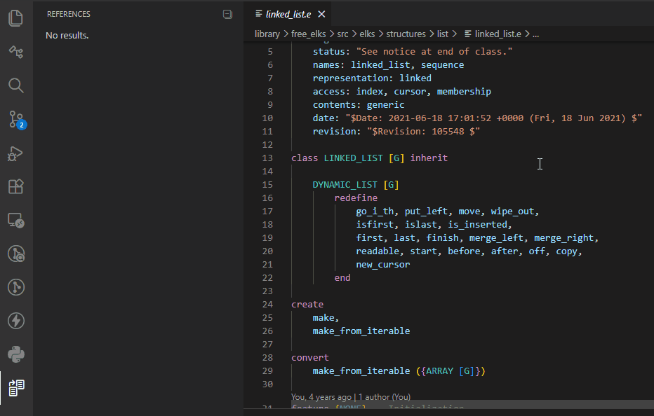
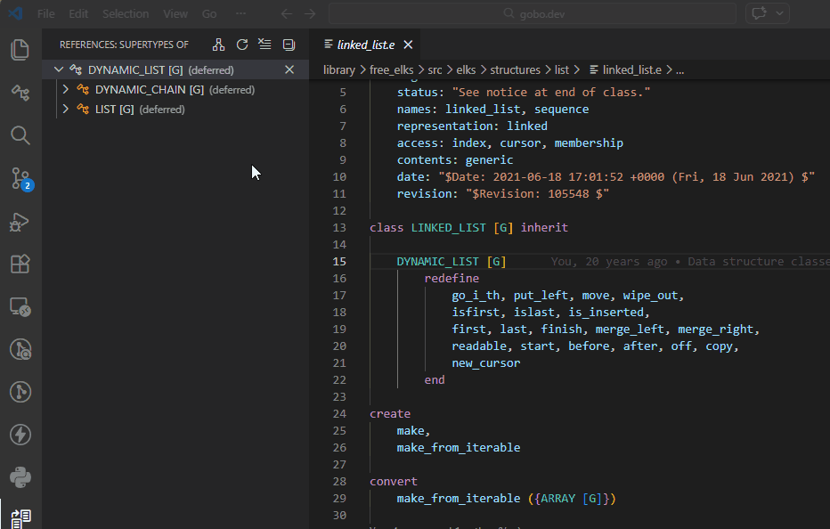
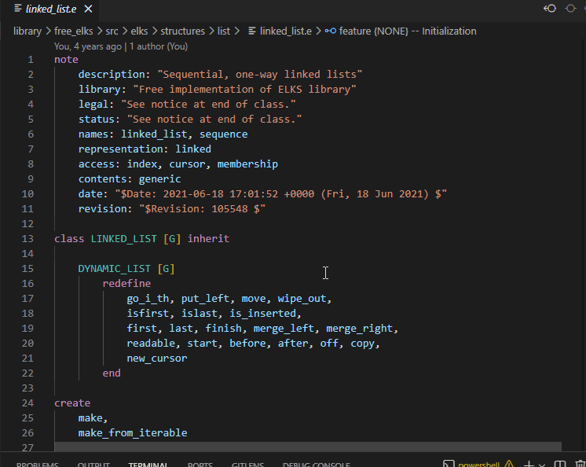

# Ancestor and Descendant Classes

The Eiffel VS Code extension supports **Show Type Hierarchy**,
allowing you to find the ancestors and descendants of a given class.

This helps you explore the inheritance structure of a system by showing
which classes a given class inherits from (ancestors), and which classes
inherit from it (descendants).

## Ancestor Classes

Place the cursor on a class name, then:

- Right-click and select **Show Type Hierarchy**

The list of ancestor classes of the selected class is displayed
in the *References* panel. Click on one of these classes to open
its class text.

## Descendant Classes

To see the list of descendant classes of a given class, follow the
same steps above to open the *References* panel, then select the
**Show Subtypes** toggle button.

## Peek Ancestor/Descendant Classes

Instead of using the *References* panel, you can use
**Peek Type Hierarchy**:

- Right-click and select **Peek Type Hierarchy**

The ancestor and descendant classes are displayed in an inline popup,
allowing you to inspect the code without leaving the current context.

## See also

- [Code Navigation overview](../README.md#-code-navigation)
