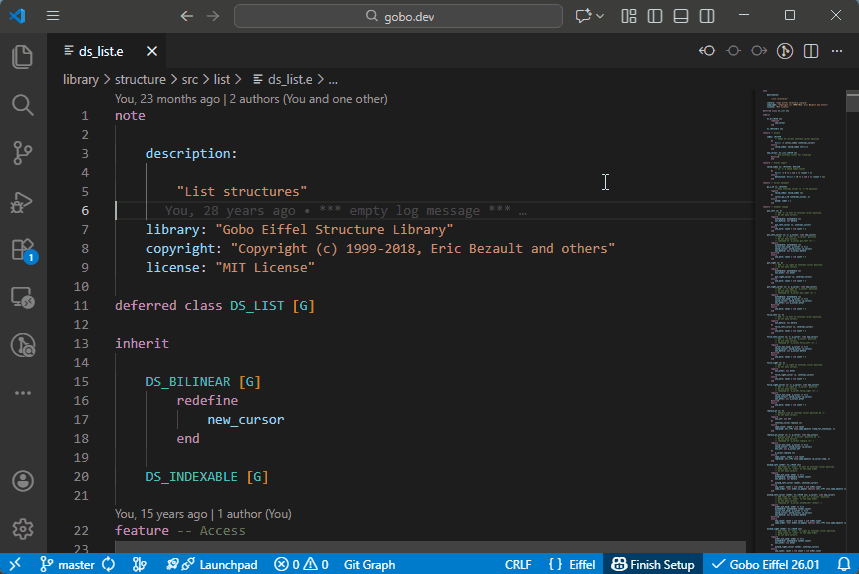
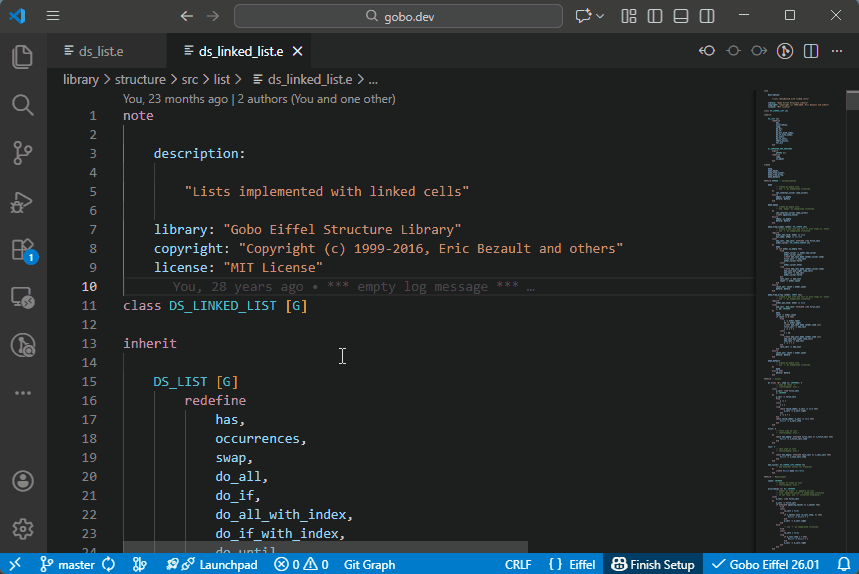
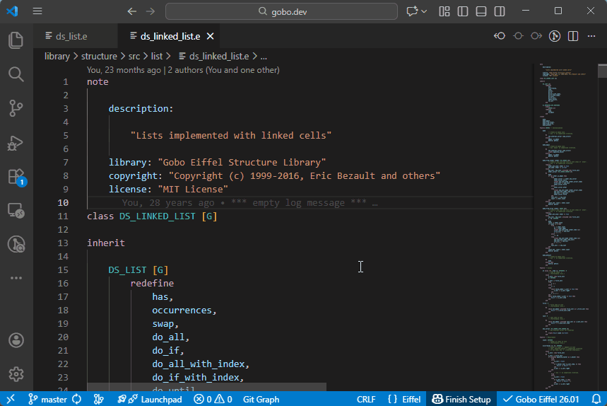
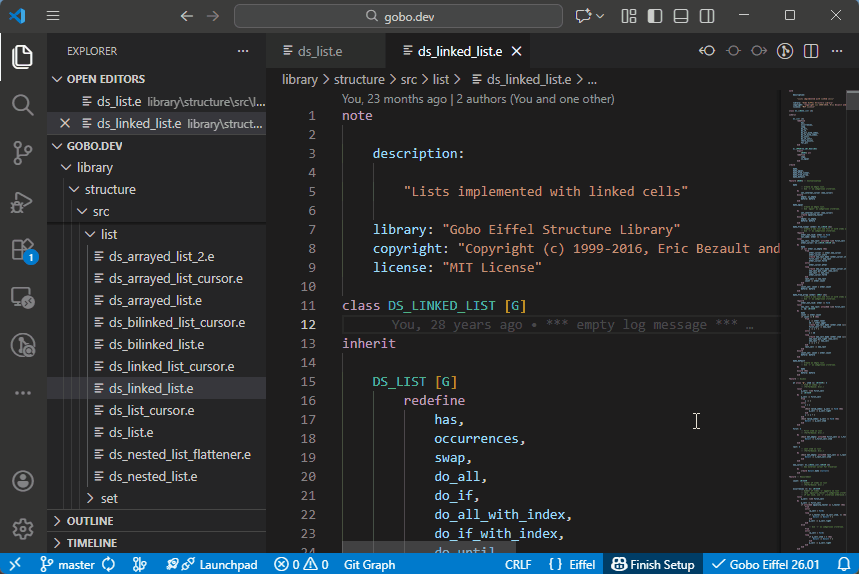

# Class and Feature Search

The Eiffel VS Code extension integrates with VS Code’s **symbol search**
to let you quickly navigate classes and features in your project.

## Searching for a Class

To search for a class:

- Press **`Ctrl+T`**, or
- Click in the **Search Bar** at the top of the VS Code window and type **`#`**

This displays a list of all classes available in the current Eiffel project.
As you continue typing, the list is automatically filtered until you find
the class you are looking for.

## Searching for a Feature in a Given Class

To search for a feature of a specific class:

- In the **Search Bar**, type the class name preceded by **`#`**, or
- Place the cursor on the class name in the **Editor** and press **`Ctrl+T`**

Then type **`.`** after the class name.  
This displays the list of all features of the class (both declared and inherited).

As you type, the list is filtered to match your input.  
The tooltip indicates filename of the class in which each feature is declared.

## Searching for a Feature in the Current Class

To search for a feature declared in the **current class**:

- Press **`Ctrl+Shift+O`**, or
- Type **`@`** in the **Search Bar**

This displays all features declared in the current class.  
You can continue typing to filter the list until you find the desired feature.

## Feature Navigation via the Outline Panel

The list of features declared in the current class is also available in
the **Outline** panel, which provides a structured view of the class
and allows quick navigation.

## See also

- [Code Navigation overview](../README.md#-code-navigation)
