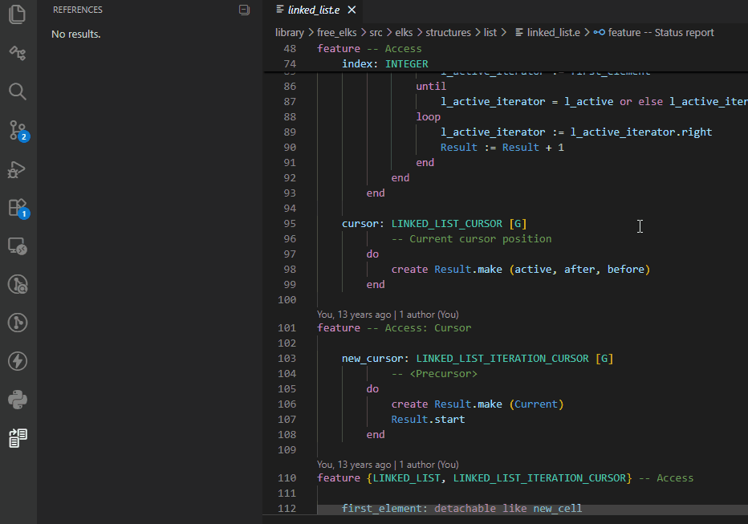
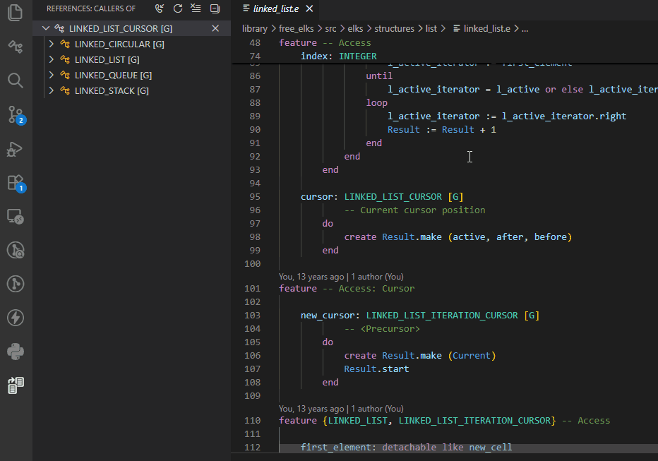
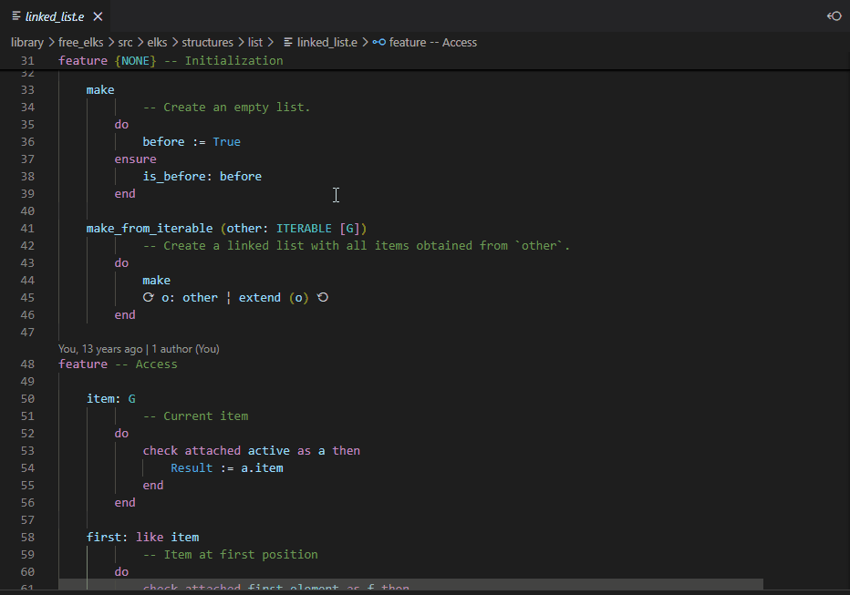

# Client and Supplier Classes

The Eiffel VS Code extension supports **Show Call Hierarchy**,
allowing you to find the clients and suppliers of a given class.

This helps you understand class dependencies by showing which classes
use a given class (clients), and which classes it depends on (suppliers).

## Client Classes

Place the cursor on a class name, then:

- Right-click and select **Show Call Hierarchy**, or
- Press **`Shift+Alt+H`**

The list of client classes of the selected class is displayed
in the *References* panel. Click on one of these classes to open
its class text.

## Supplier Classes

To see the list of supplier classes of a given class, follow the
same steps above to open the *References* panel, then select the
**Show Outgoing Calls** toggle button.

## Peek Client/Supplier Classes

Instead of using the *References* panel, you can use
**Peek Call Hierarchy**:

- Right-click and select **Peek Call Hierarchy**

The client and supplier classes are displayed in an inline popup,
allowing you to inspect the code without leaving the current context.

## See also

- [Code Navigation overview](../README.md#-code-navigation)
