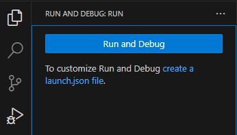
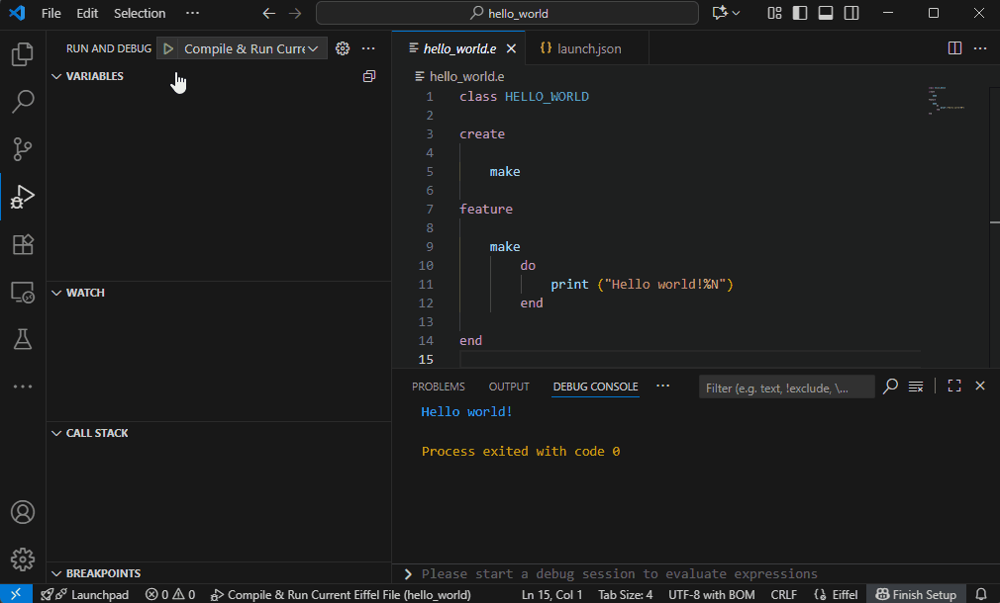
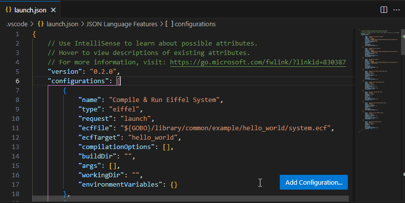

# Compile And Run in the *Debug Console* panel

You can easily **compile and run Eiffel systems** directly from the *Run And Debug* panel. When you click **`create a launch.json file`**, VS Code automatically generates a file pre-filled with several *Launch Configurations*. These can be used as-is or customized for more advanced workflows.



The pre-filled configurations are:

* [Compile & Run Current Eiffel File](#compile--run-current-eiffel-file)
* [Compile Current Eiffel File](#compile-current-eiffel-file)
* [Run Current Eiffel File](#run-current-eiffel-file)
* [Compile & Run With Current ECF File](#compile--run-with-current-ecf-file)
* [Compile With Current ECF File](#compile-with-current-ecf-file)
* [Run With Current ECF File](#run-with-current-ecf-file)
* [Compile & Run Eiffel System](#compile--run-eiffel-system)
* [Compile Eiffel System](#compile-eiffel-system)
* [Run Eiffel System](#run-eiffel-system)

Compilation output appears in the *Output* panel, whereas the compiled executable runs in the *Debug Console* panel.

To run the compiled executable in the *Terminal* panel, use the [commands](compile_and_run_in_terminal.md) available in the *Command Palette* and contextual menus.

> ⚠️ **Limitations:** Breakpoints are not currently supported when running an Eiffel system.

## Compile & Run Current Eiffel File

```json
{
	"name": "Compile & Run Current Eiffel File",
	"type": "eiffel",
	"request": "launch",
	"compilationOptions": [],
	"buildDir": "",
	"args": [],
	"workingDir": "",
	"environmentVariables": {}
}
```

This configuration compiles the Eiffel class currently open in the *Editor* and runs it in the *Debug Console* panel.



### Compilation Options

Use `compilationOptions` to pass flags to the compiler. For example:

```json
"compilationOptions": ["--finalize"]
```

compiles an optimized executable for release.
See the full list of options in the [Gobo Eiffel Compiler documentation](https://www.gobosoft.com/eiffel/gobo/tool/gec/doc/usage.html).

### Build Directory

By default, executables and intermediate files are generated in the same folder as the Eiffel file.
The executable name matches the Eiffel class name, e.g.:

* `HELLO_WORLD` → `hello_world.exe` on Windows
* `HELLO_WORLD` → `hello_world` on Linux/macOS

Intermediate files go into a `.gobo` subfolder.
To change the output location:

```json
"buildDir": "path/to/my/build/folder"
```

Supports environment variables of the form `$VAR` or `${VAR}`.

### Arguments

Pass command-line arguments to the compiled executable:

```json
"args": ["arg1", "arg2"]
```

### Working Directory

Specify the working directory for execution of the compiled executable (default: folder containing the Eiffel file):

```json
"workingDir": "path/to/my/working/folder"
```

Supports environment variables of the form `$VAR` or `${VAR}`.

### Environment Variables

Set environment variables for compilation and/or execution:

```json
"environmentVariables": {
	"VAR1": "value1",
	"VAR2": "value2"
}
```

## Compile Current Eiffel File

```json
{
	"name": "Compile Current Eiffel File",
	"type": "eiffel",
	"request": "launch",
	"compilationOptions": [],
	"buildDir": "",
	"environmentVariables": {},
	"compileOnly": true
}
```

This configuration compiles the Eiffel class currently open in the *Editor* but **does not execute** the compiled executable.

`compileOnly` prevents execution.
All other settings work as described above.

## Run Current Eiffel File

```json
{
	"name": "Run Current Eiffel File",
	"type": "eiffel",
	"request": "launch",
	"buildDir": "",
	"args": [],
	"workingDir": "",
	"environmentVariables": {},
	"runOnly": true
}
```

This configuration **runs an already-compiled executable** for the Eiffel class currently open in the *Editor*, in the *Debug Console* panel.

`runOnly` disables compilation.
`buildDir` must still point to the folder containing the executable.
All other settings work as described above.

## Compile & Run With Current ECF File

```json
{
	"name": "Compile & Run With Current ECF File",
	"type": "eiffel",
	"request": "launch",
	"compilationOptions": [],
	"buildDir": "",
	"args": [],
	"workingDir": "",
	"environmentVariables": {}
}
```

This configuration compiles and runs the Eiffel system described by the **ECF file currently open** in the *Editor*.

Learn more about ECF files in the [Gobo Eiffel documentation](https://www.gobosoft.com/eiffel/gobo/library/tools/doc/ecf.html).

### ECF Target

If the ECF defines multiple targets, the last one is used by default. Specify another target:

```json
"ecfTarget": "my_target"
```

### Compilation Options

Use `compilationOptions` to pass flags to the compiler. For example:

```json
"compilationOptions": ["--finalize"]
```

compiles an optimized executable for release.
See the full list of options in the [Gobo Eiffel Compiler documentation](https://www.gobosoft.com/eiffel/gobo/tool/gec/doc/usage.html).

### Build Directory

By default, executables and intermediate files are generated in the same folder as the ECF file.
The executable name is inferred from the ECF description.
Intermediate files go into a `.gobo` subfolder.
To change the output location:

```json
"buildDir": "path/to/my/build/folder"
```

Supports environment variables of the form `$VAR` or `${VAR}`.

### Arguments

Pass command-line arguments to the compiled executable:

```json
"args": ["arg1", "arg2"]
```

### Working Directory

Specify the working directory for execution of the compiled executable (default: folder containing the ECF file):

```json
"workingDir": "path/to/my/working/folder"
```

Supports environment variables of the form `$VAR` or `${VAR}`.

### Environment Variables

Set environment variables for compilation and/or execution:

```json
"environmentVariables": {
	"VAR1": "value1",
	"VAR2": "value2"
}
```

## Compile With Current ECF File

```json
{
	"name": "Compile With Current ECF File",
	"type": "eiffel",
	"request": "launch",
	"ecfTarget": "",
	"compilationOptions": [],
	"buildDir": "",
	"environmentVariables": {},
	"compileOnly": true
}
```

This configuration compiles the Eiffel system described by the **ECF file currently open** in the *Editor* but **does not execute** the compiled executable.

`compileOnly` prevents execution.
All other settings work as described above.

## Run With Current ECF File

```json
{
	"name": "Run With Current ECF File",
	"type": "eiffel",
	"request": "launch",
	"ecfTarget": "",
	"buildDir": "",
	"args": [],
	"workingDir": "",
	"environmentVariables": {},
	"runOnly": true
}
```

This configuration **runs an already-compiled executable** for the Eiffel system described by the ECF file currently open in the *Editor*, in the *Debug Console* panel.

`runOnly` disables compilation.
`buildDir` must still point to the folder containing the executable.
All other settings work as described above.

## Compile & Run Eiffel System

```json
{
	"name": "Compile & Run Eiffel System",
	"type": "eiffel",
	"request": "launch",
	"ecfFile": "${GOBO}/library/common/example/hello_world/system.ecf",
	"ecfTarget": "hello_world",
	"compilationOptions": [],
	"buildDir": "",
	"args": [],
	"workingDir": "",
	"environmentVariables": {}
}
```

This configuration is similar to [*Compile & Run With Current ECF File*](#compile--run-with-current-ecf-file) above, except that the ECF file is explicitly specified with `ecfFile` instead of using the file currently open in the *Editor*. This is just a template to compile and run the *Hello World* example included in the *Gobo Eiffel* installation. Replace `ecfFile` and `ecfTarget` with your own values.

`ecfFile` supports environment variables of the form `$VAR` or `${VAR}`.

If you need to compile several Eiffel systems, or need several compilation modes or several sets of arguments, you can add more such *Launch Configurations* by clicking on the *Add Configuration* button and selecting *Gobo Eiffel: Compile & Run Eiffel System*.



## Compile Eiffel System

```json
{
	"name": "Compile Eiffel System",
	"type": "eiffel",
	"request": "launch",
	"ecfFile": "${GOBO}/library/common/example/hello_world/system.ecf",
	"ecfTarget": "hello_world",
	"compilationOptions": [],
	"buildDir": "",
	"environmentVariables": {},
	"compileOnly": true
}
```

This configuration compiles the Eiffel system described by the ECF file `ecfFile` but **does not execute** the compiled executable.

All settings work as described above.

If you need to compile several Eiffel systems, or need several compilation modes, you can add more such *Launch Configurations* by clicking on the *Add Configuration* button and selecting *Gobo Eiffel: Compile Eiffel System*.

## Run Eiffel System

```json
{
	"name": "Run Eiffel System",
	"type": "eiffel",
	"request": "launch",
	"ecfFile": "${GOBO}/library/common/example/hello_world/system.ecf",
	"ecfTarget": "hello_world",
	"buildDir": "",
	"args": [],
	"workingDir": "",
	"environmentVariables": {},
	"runOnly": true
}
```

This configuration **runs an already-compiled executable** for the Eiffel system described by the ECF file `ecfFile`, in the *Debug Console* panel.

All settings work as described above.

If you need to compile several Eiffel systems, or need several sets of arguments, you can add more such *Launch Configurations* by clicking on the *Add Configuration* button and selecting *Gobo Eiffel: Run Eiffel System*.
