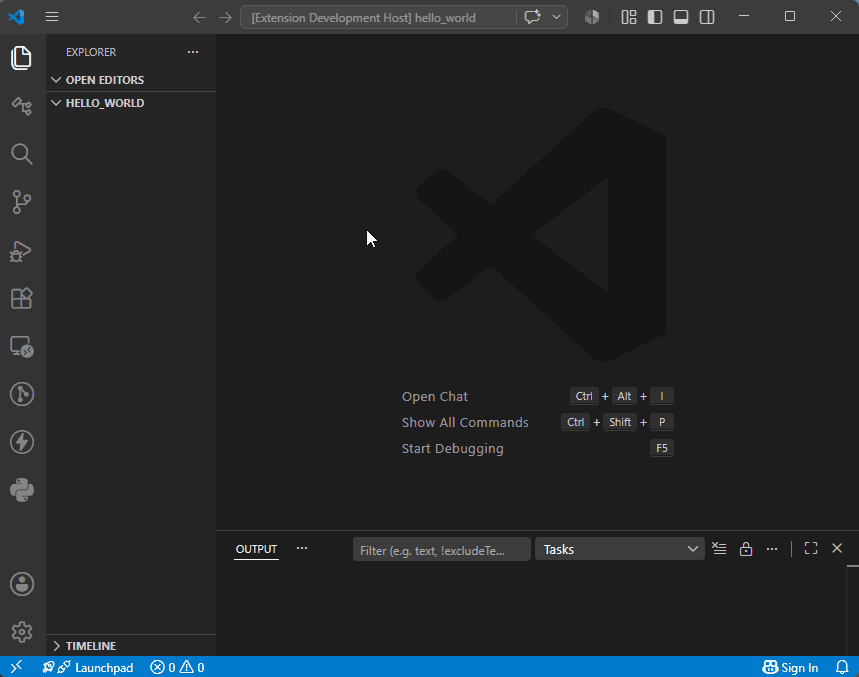

# Create Eiffel Project

When starting from scratch with an empty workspace folder,
you can ask VS Code to create a simple Eiffel project to
start with:

* From the *Command Palette* (with `Ctrl+Shift+P`, or `Cmd+Shift+P` on
  MacOS) type "Gobo Eiffel" and select
  **Gobo Eiffel: Create Eiffel Project...**
* If this is the first time you use this VS Code extension,
  you will be asked to install *Gobo Eiffel*. Just follow
  the instructions.
* Enter the name of the project (e.g. `hello_world`) when asked
  and type `Enter`.

You now have a simple *Hello World* Eiffel file that you can
edit, customize, [compile and run](https://gobo-eiffel.github.io/gobo-vscode/doc/hello_world.html).
