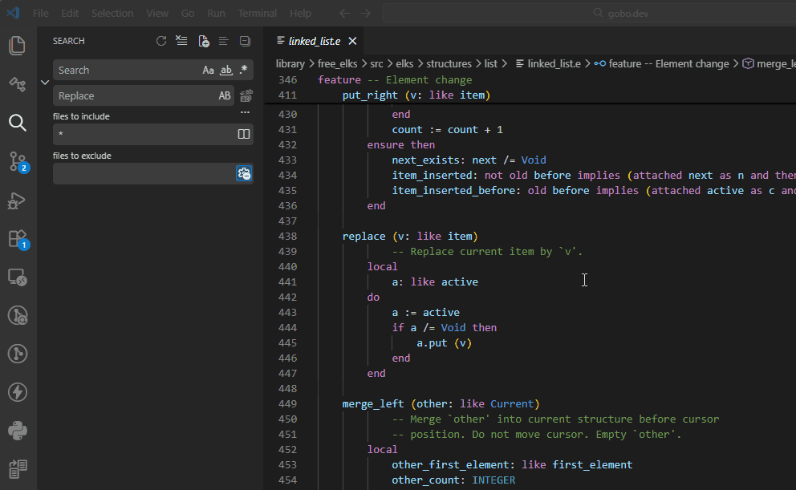
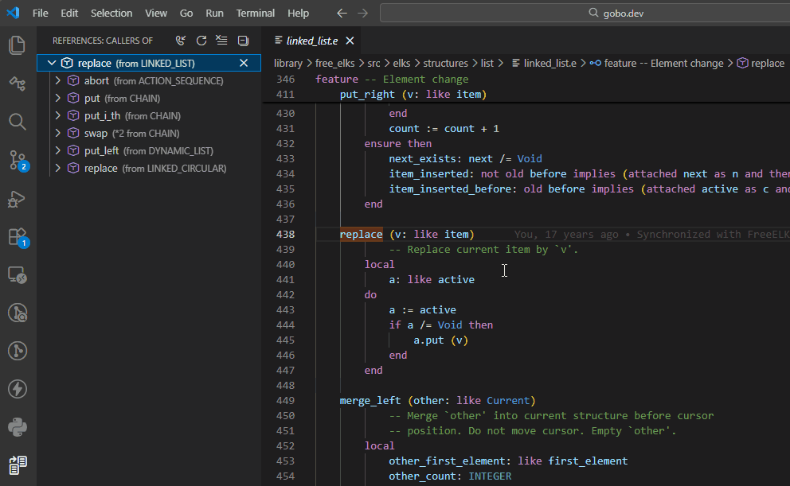
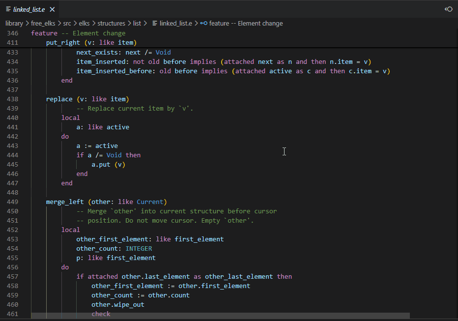

# Feature Callers and Callees

The Eiffel VS Code extension supports **Show Call Hierarchy**,
allowing you to find the callers and callees of a given feature.

The call hierarchy helps you understand how features interact by showing
which features call a given feature, and which features it calls.

## Callers of a Feature

Place the cursor on a feature name, then:

- Right-click and select **Show Call Hierarchy**, or
- Press **`Shift+Alt+H`**

The list of features that call the selected feature is displayed
in the *References* panel. Click on one of these features to see
where the calls occur in that feature.

## Callees of a Feature

To see the list of features called from a given feature, follow the
same steps above to open the *References* panel, then select the
**Show Outgoing Calls** toggle button.

## Peek Feature Callers/Callees

Instead of using the *References* panel, you can use
**Peek Call Hierarchy**:

- Right-click and select **Peek Call Hierarchy**

The callers and callees are displayed in an inline popup,
allowing you to inspect the code without leaving the current context.

## See also

- [Code Navigation overview](../README.md#-code-navigation)
