# Go to Definition

The Eiffel VS Code extension supports **Go to Definition** for all
Eiffel symbols, allowing you to quickly navigate to their
declarations.

## Features

Place the cursor on a feature name, then:

- Right-click and select **Go to Definition**, or
- Press **`F12`**

The *Editor* will open the class where the feature is defined and
position the cursor at its declaration.

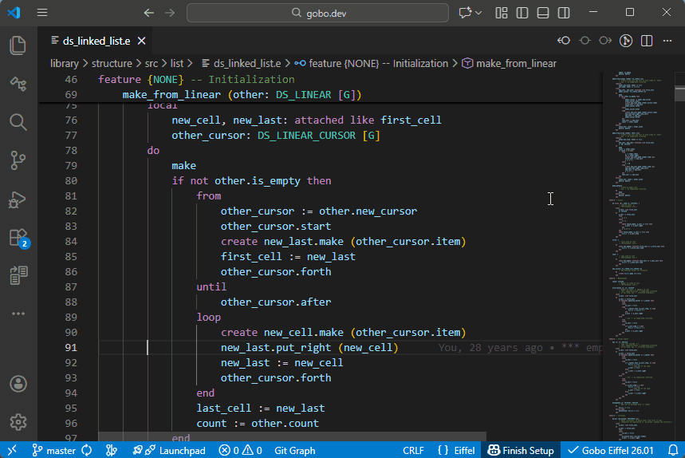

## Peek Definition

Instead of navigating away from the current file, you can use
**Peek Definition**:

- Right-click and select **Peek Definition**, or
- Press **`Alt+F12`**

The definition is shown in an inline popup, allowing you to inspect
the code without leaving the current context.

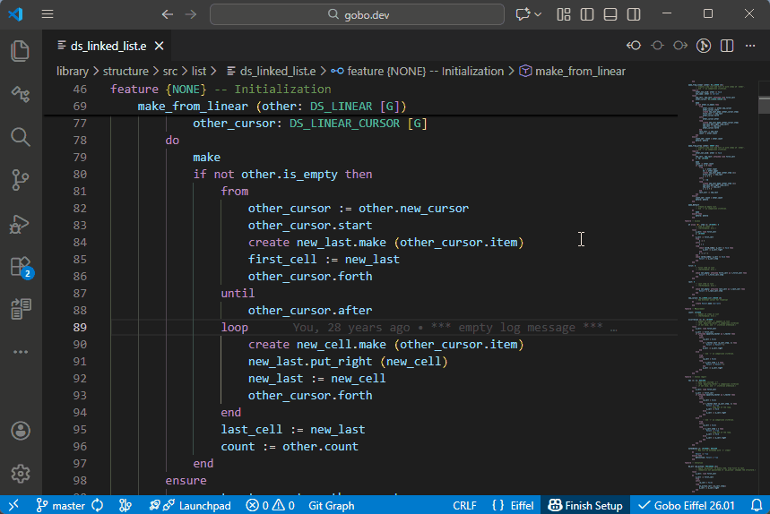

## Other Eiffel Symbols

**Go to Definition** and **Peek Definition** work with all major
Eiffel symbols, including:

### Local variables

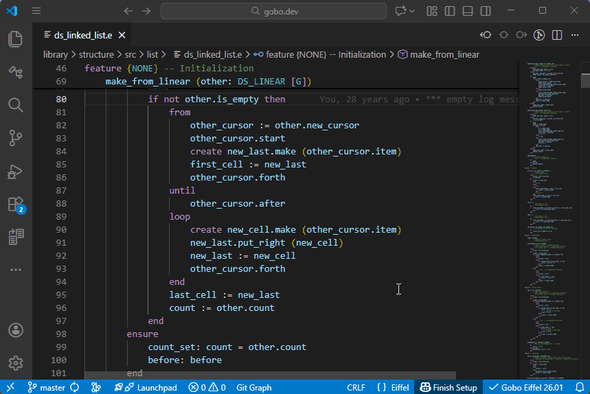

### Arguments

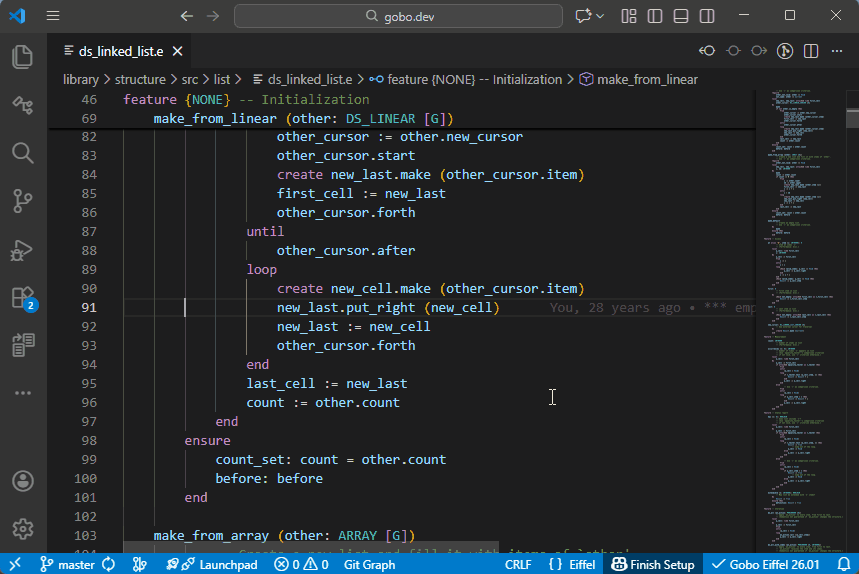

### Object-test locals

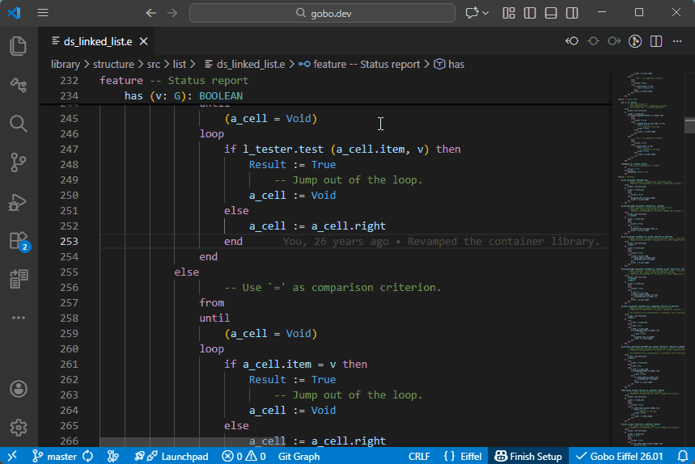

### Iteration cursors

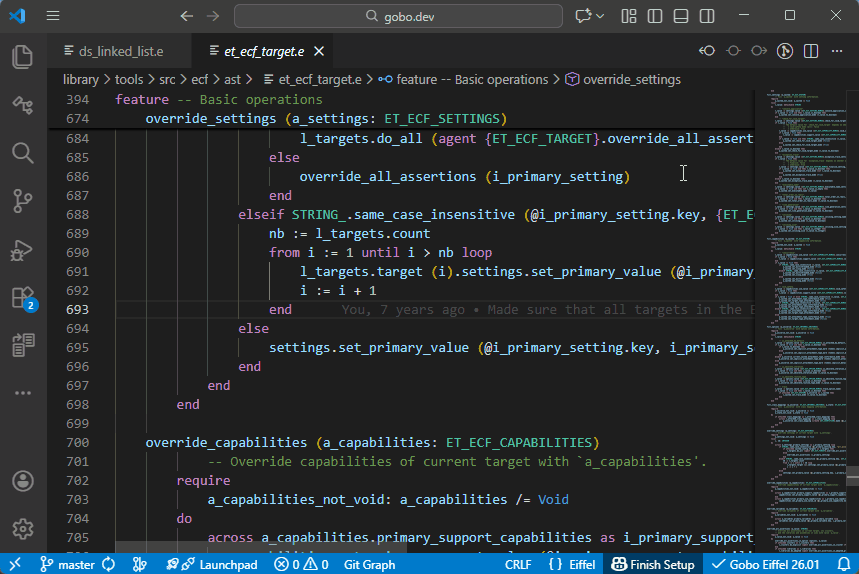

### Inline separate arguments

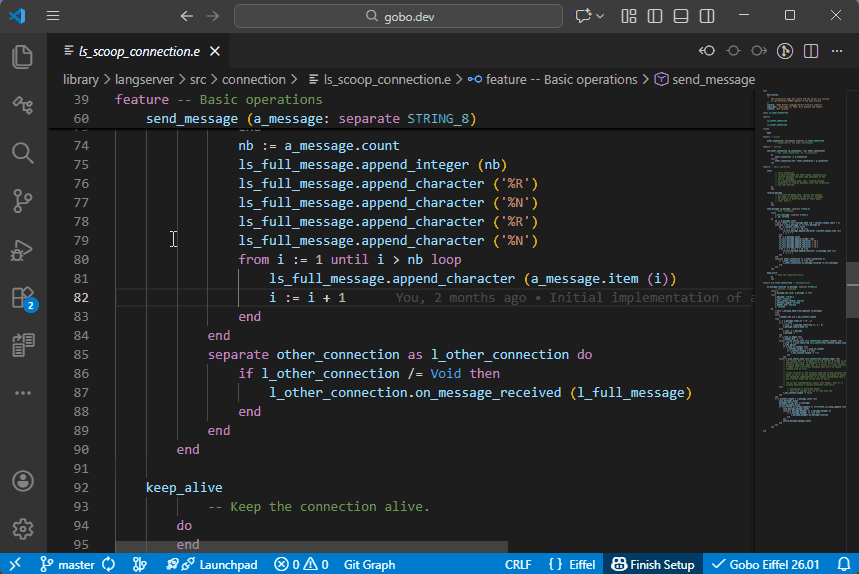

### Tuple labels

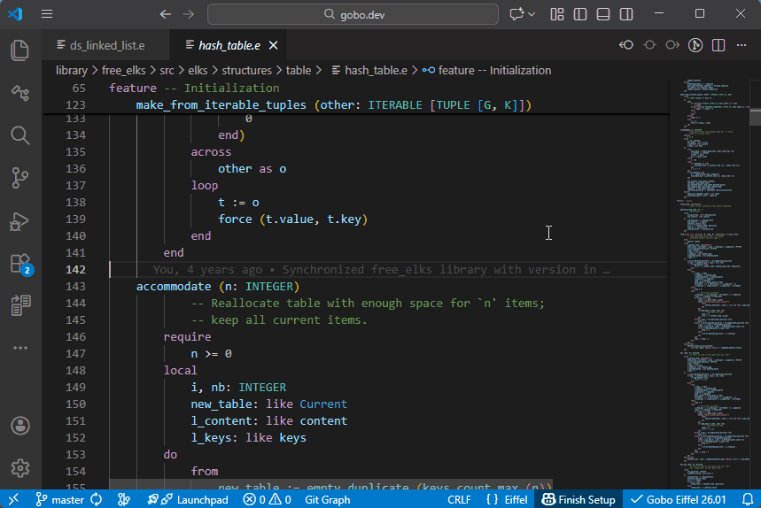

### `Result` in a function

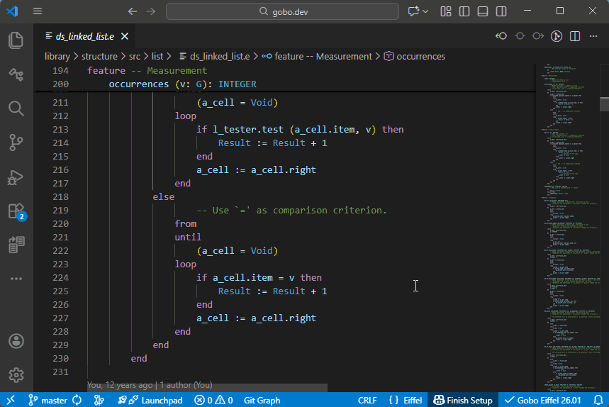

### `Precursor` in a redefined routine

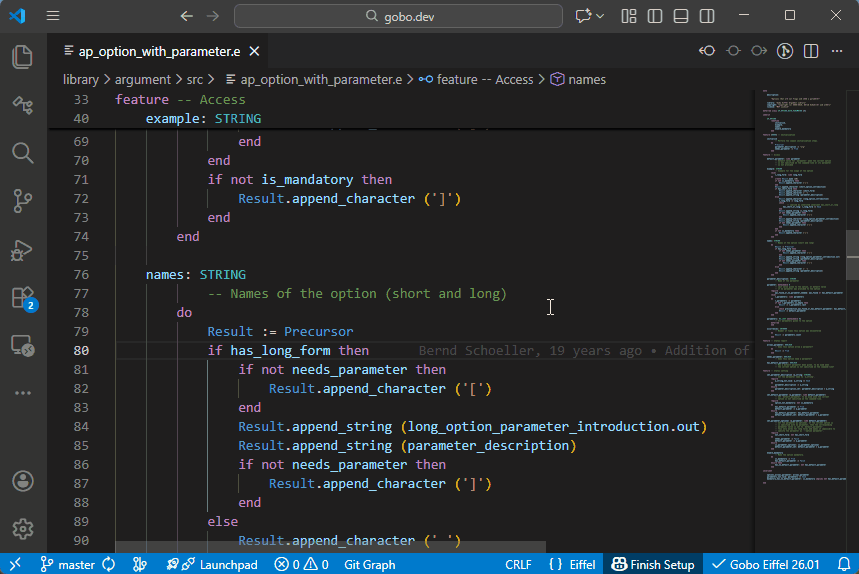

### Classes

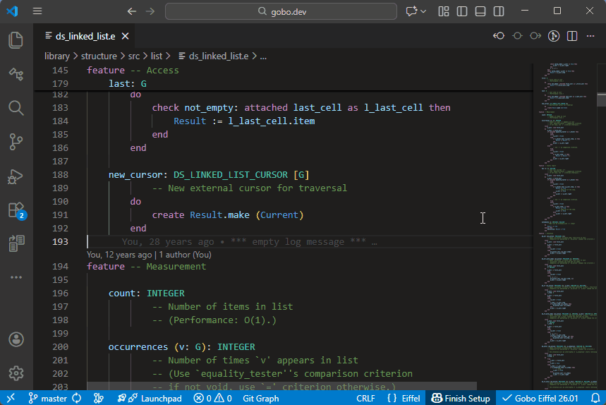

### Formal generic parameters

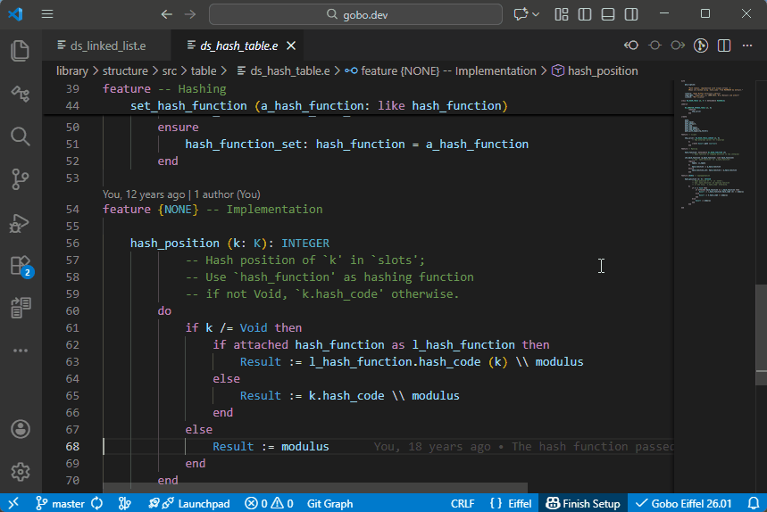

## See also

- [Code Navigation overview](../README.md#-code-navigation)
