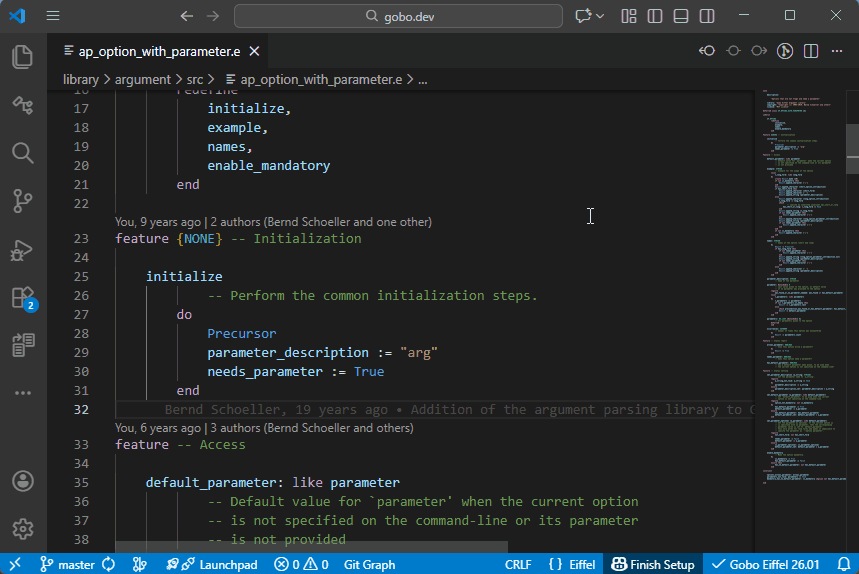
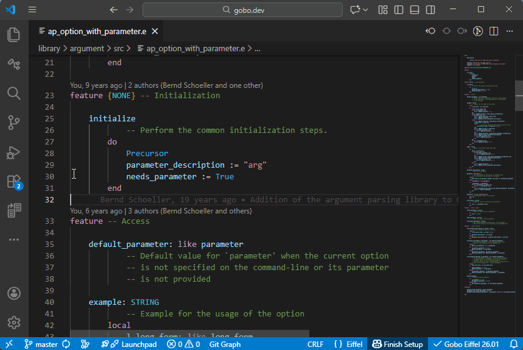

# Go to Implementations

The Eiffel VS Code extension supports **Go to Implementations**,
allowing you to quickly navigate to all precursors and redeclarations
of a given feature.

## Feature Precursors and Redeclarations

Place the cursor on a feature name, then:

- Right-click and select **Go to Implementations**

The matching features are displayed in an inline popup, allowing you
to inspect their declarations without leaving the current context.

In this example, the feature `initialize` from class
`AP_OPTION_WITH_PARAMETER` has:

- One precursor in its parent class `AP_OPTION`
- Three redeclarations in its descendant classes
  `AP_INTEGER_OPTION`, `AP_INTEGER_BOOLEAN`, and
  `AP_ENUMERATION_OPTION`

## Find Implementations

Instead of displaying the list of implementations in an inline popup,
you can show them in a dedicated panel on the left side of the
*Editor*.

- Right-click and select **Find Implementations**

## Order of Feature Redeclarations

Although the Eiffel language server provides implementations in
declaration order (ancestors first, followed by descendants), VS Code
displays them in alphabetical order by filename.

## See also

- [Code Navigation overview](../README.md#-code-navigation)
