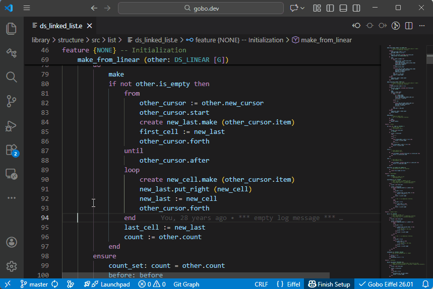
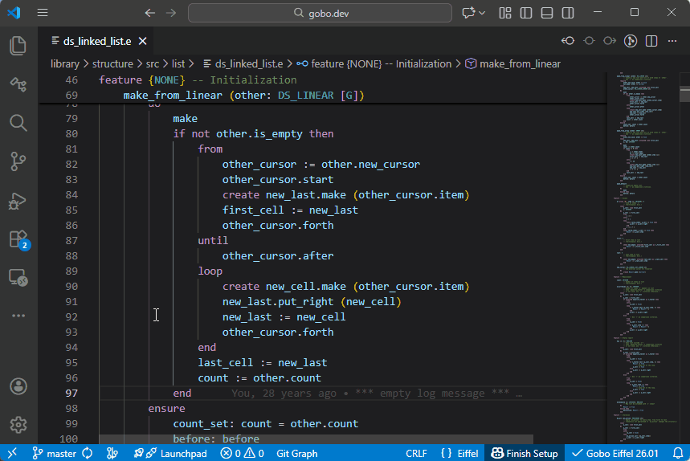

# Go to Type Definition

The Eiffel VS Code extension supports **Go to Type Definition**,
allowing you to quickly navigate to the class that defines the type
of an Eiffel symbol.

## Features

Place the cursor on a function or attribute name, then:

- Right-click and select **Go to Type Definition**

The *Editor* opens the base class of the type associated with the
selected feature.

## Peek Type Definition

Instead of navigating away from the current file, you can use
**Peek Type Definition**:

- Right-click and select **Peek Type Definition**

The corresponding class is displayed in an inline popup, allowing you
to inspect the type definition without leaving the current context.

## Other Eiffel Symbols

**Go to Type Definition** and **Peek Type Definition** are available
for all major Eiffel symbols that have a type, including:

- Local variables
- Arguments
- Object-test locals
- Iteration cursors
- Inline separate arguments
- Tuple labels
- The `Result` and `Current` entities
- `Precursor` in feature redefinitions
- Boolean constants `True` and `False`
- Classes
- Formal generic parameters

## See also

- [Code Navigation overview](../README.md#-code-navigation)
