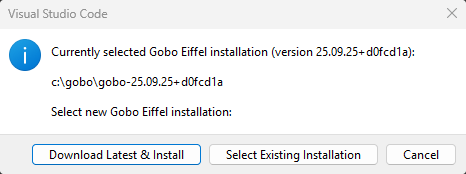
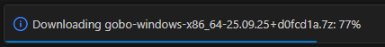
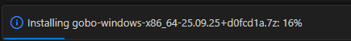
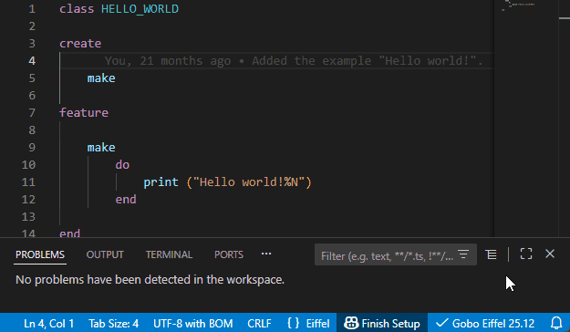
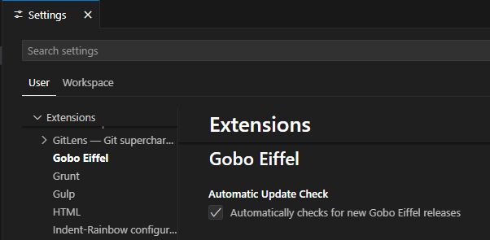

# Select Gobo Eiffel Installation

The first time you use this extension, you’ll be asked to configure a **Gobo
Eiffel installation**.
This is required because the extension relies on the
[Gobo Eiffel](https://www.gobosoft.com)
toolchain to compile, run, and analyze your Eiffel code.



> 🟢 **Recommended for beginners**: Simply choose **Download Latest & Install**.
> The extension will automatically set up the most recent release of *Gobo Eiffel*
> for you.

## 📥 Download Latest & Install

The easiest option is to let the extension download and install the most recent
*Gobo Eiffel* release.
Releases are hosted on [GitHub](https://github.com/gobo-eiffel/gobo/releases),
and by default the one tagged as **latest** will be used.

You’ll be prompted to choose an installation folder. The toolchain will then be
installed inside a subfolder such as:

```shell
path/to/install-folder/gobo-<version>
```

A progress indicator will appear in the bottom-right corner of VS Code during
download and installation:




## 📂 Use An Existing Installation

If you already have *Gobo Eiffel* installed on your machine, you can simply
point the extension to it.
Choose the **root folder** of your installation (the one containing `bin/`,
`library/`, `tool/`, etc.).

> 💡 For best results, we recommend using the most recent release of Gobo Eiffel.

## 🔄 Switch To Another Installation

At any time, you can change the selected installation from the *Command Palette*
with the command **Gobo Eiffel: Select Gobo Eiffel Installation**.


This command is also available from the status bar. Just clik on the *Gobo Eiffel*
label which indicates the version of the Eiffel language server currently used:



## ✅ Automatically Check For Updates

By default, the extension automatically checks once every 24 hours for newer
releases of *Gobo Eiffel*.
If a newer version is found, you’ll be prompted to download and install it.

You can turn off this behavior by setting:

```json
"gobo-eiffel.automaticUpdateCheck": false
```

in the `settings.json` file, or from the UI:



## ⚡ Nightly Build (Advanced)

If you prefer cutting-edge features, you can switch from stable releases of
*Gobo Eiffel* to the **nightly build**.
Enable it with the following setting:

```json
"gobo-eiffel.useNightlyBuild": true
```
