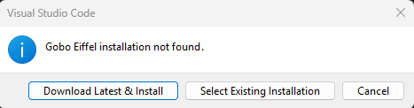

# Select Gobo Eiffel Installation

This dialog will be shown the first time you use this extension.



This is because it uses the [*Gobo Eiffel*](https://www.gobosoft.com) toolchain to perform some actions on your Eiffel code.

## Download Latest & Install

*Gobo Eiffel* releases are available on [GitHub](https://github.com/gobo-eiffel/gobo/releases). By default, the release tagged as *latest* will be downloaded and installed on your computer. You will be asked to select an installation folder. This folder should exist. *Gobo Eiffel* will be install in a subfolder of the form:

```shell
path/to/install-folder/gobo-<version>
```

Progress information will be shown in the bottom-right corner of VC Code during download and installation.


## Select Existing Installation

If you are not new to Eiffel, you might already have *Gobo Eiffel* installed on your computer. You may decide to let the VC Code extension use this *Gobo Eiffel* installation. Select the corresponding folder (the root folder containing `bin/`, `library/`, `tool/`, etc.).

Note that in order to work properly, it is recommended to use the most recent version of *Gobo Eiffel*.

## Select Another Gobo Eiffel Installation

Use the *Command Palette* command **Gobo Eiffel: Select Gobo Eiffel Installation** to change the version of *Gobo Eiffel*.


## Automatically Check For Updates

By default, VS Code will check once every 24 hours whether a newer version of *Gobo Eiffel* is available. If so, you will be prompted to download and install it.

You can disable this check with the user setting `gobo-eiffel.automaticUpdateCheck`.


## Nightly Build

For advanced users, it is possible to use the *Nightly Build* instead of the latest release of *Gobo Eiffel*. Set the user setting `gobo-eiffel.useNightlyBuild`.
