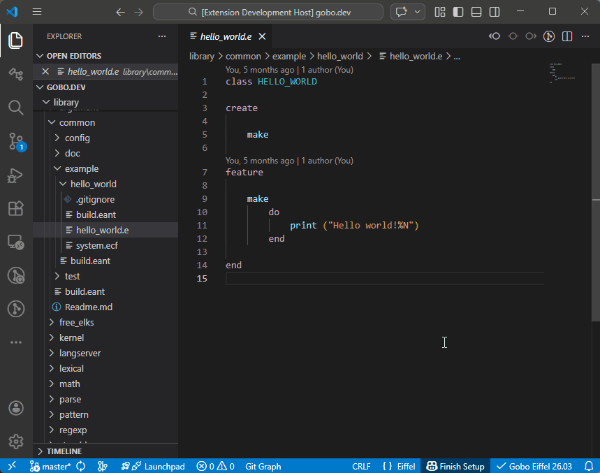
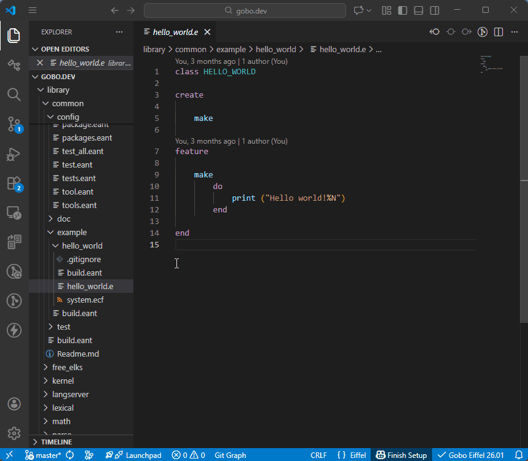

# Workspace ECF File

To provide accurate feedback while editing Eiffel code, the Eiffel
analyzer must inspect not only the current class, but also all related
classes in the workspace and in external Eiffel libraries.

This is made possible by an **ECF file** (*Eiffel Configuration File*).
An ECF file describes where classes are located and specifies options
that control how they are analyzed.

In the Gobo Eiffel VS Code extension, a **workspace ECF file** can be
specified using *workspace-specific settings*, together with an
associated **ECF target** (the entry point defined in the ECF file).

---

## Workspace Settings

| Setting | Description | Default |
| ------- | ----------- | ------- |
| **`gobo-eiffel.workspaceEcfFile`** | ECF file to analyze Eiffel classes in current workspace. | `null` |
| **`gobo-eiffel.workspaceEcfTarget`** | Target in ECF file to analyze Eiffel classes in current workspace. | `null` |

If no ECF file is specified, the extension looks for ECF files at the
root of the workspace and automatically selects the last one
(alphabetically).  
If no ECF file is found, a default configuration is used, based on
*Gobo Eiffel* libraries and recursive clusters starting at the
workspace root.

If the ECF target is not specified, the last target defined in the
selected ECF file is used.

## Select Workspace ECF File

The easiest way to configure these settings is to choose
**Select Workspace ECF File** from a contextual menu.

You can then enter the name of the ECF file and its target.
The file path is relative to the root folder of the workspace.

## Select Current File as Workspace ECF File

You can also select an existing ECF file directly.

In the contextual menu of the file, choose
**Select Current File as Workspace ECF File**.

The corresponding workspace-specific settings are filled in
automatically.

## Show Workspace ECF File

To open and edit the workspace ECF file, choose
**Show Workspace ECF File** from a contextual menu.

## Create an ECF File

If your workspace does not yet contain an ECF file, you can create one
using the **Create ECF File** command.

See
[Create ECF File](create_ecf_file.md)
for more details.

## See also

All the commands described above are also available from the
*Command Palette*.

Open the *Command Palette* with `Ctrl+Shift+P`
(or `Cmd+Shift+P` on macOS), then type `Gobo Eiffel` to see the
available commands.

For an overview of all commands provided by the extension, see
[Commands overview](../README.md#-commands).
